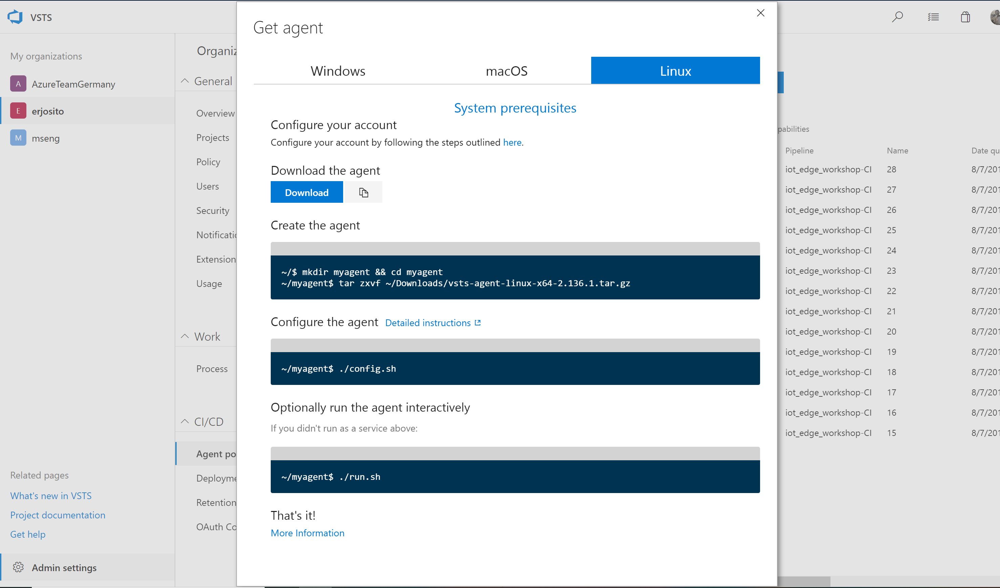

# Build Agent for ARM-based containers

You are probably working on an x86- or x64-based system, so you will not be able to build ARM-based Linux containers. There are possibilities to build containers in VSTS or even in Azure Container Registry, but unfortunately those options only support x86/x64 containers at the time of this writing. However, you can use a VM with CPU emulation to build an ARM-based container. This build process can be triggered from VSTS, as long as you have a VSTS Build Agent installed there. This guide will show how to use an Ubuntu VM as a remote build agent to build and push ARM-based Linux containers to our Container Repository.

First you need to create a Linux VM. In this guide we will use UbuntuLTS as OS. This command will create a Linux VM with your SSH keys. It is therefore recommended to run this from a Linux environment (Linux subsystem in Windows, MacOS, Linux, etc.): 

```
az vm create -n buildagent -g $rgname --image UbuntuLTS
```

After the VM is there, you can login over SSH. An `apt update` and an `apt upgrade` would probably not harm. Now you can install QEMU emulation software (that we will need to emulate).

```
sudo apt install -y qemu qemu-user-static qemu-user binfmt-support
```

After the installation is ready, you can include the file `/usr/bin/qemu-arm-static` in your container so that the container is built on an emulated ARM CPU, with the line `COPY qemu-arm-static /usr/bin/qemu-arm-static`.

You need to install Docker-CE on your VM. You can follow the official Docker documentation for this: 

You probably want that the current user is allowed to run docker. The reason is because when you run the build agent, it will run under your user, and it will try to run all operations as your user, including docker build and push tasks. You can find out your current username and assign it to the docker group with these commands:

```
user=$(whoami)
sudo gpasswd -a $user docker
```

Now you need to log out from your SSH session and log in again, so that these changes take effect.

Since the whole build pipeline will run in the build agent, we want to make the VM able to interact with Azure IoT. We need to install the Azure CLI, and the Azure IoT Extension.

* Install the Azure CLI using this guide: https://docs.microsoft.com/en-us/cli/azure/install-azure-cli-apt?view=azure-cli-latest
* Install the Azure CLI IoT Extension with this command: `az extension add --name azure-cli-iot-ext`

Now we only need one last thing. Since the build pipeline will be driven by VSTS, we need to install the VSTS Build Agent in this VM. You can download the bits from VSTS with wget, and then follow the instructions. You will find the link to download the agent, as well as the instructions, when you create a new agent pool (Settings -> CI/CD -> Agent Pools). 



When you execute the last step of the installation (running `./run.sh`) the state of the pool agent should turn green, as the following image shows (ignore all the builds that have already been run in this pool, you will have an empty list instead)


