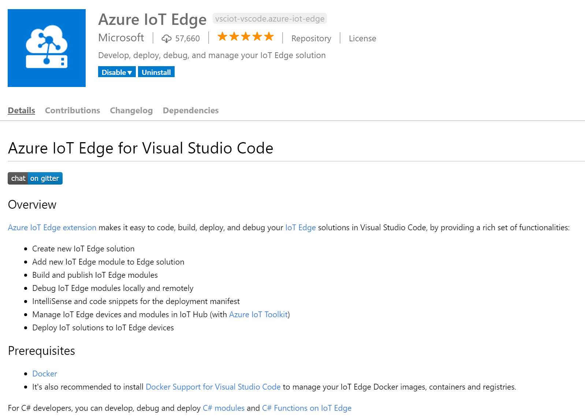
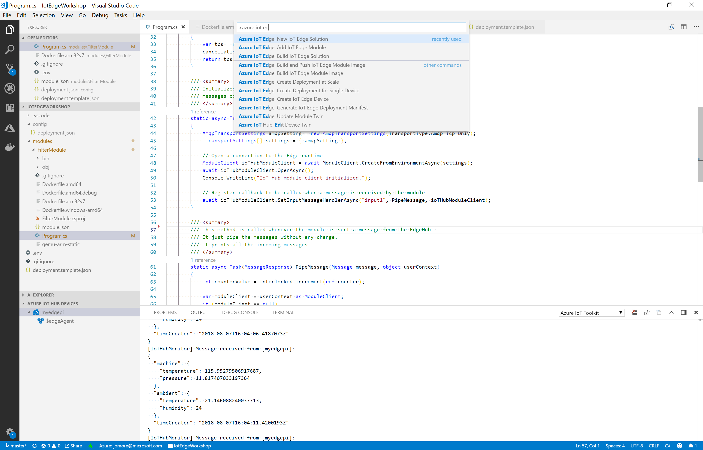
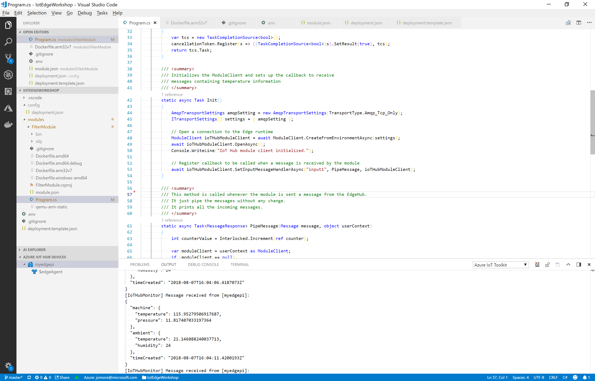

# Visual Studio Code and Azure IoT Edge extension

Make sure that you have Visual Studio Code installed, and the Azure IoT Edge extension installed. The next figure explains what this extension looks like.

This guide does not show how to create a Github repository and clone it to your desktop, you should be able to find plenty of guides in Internet if you need help. You can now go to that directory and add a new IoT Edge Solution to your directory. You can access the Command Palette with the key combination Ctrl+Shift+P. You should select the command `New IoT Edge Solution`.

You can select the programming language for your boilerplate code. This example uses C#. It should look something like this.

Replace code with variables that we will use in the VSTS pipeline. The syntax for VSTS variables is `#{variable_name}#`. In the VSTS guide you will see how to replace these placeholders with the actual values. You can look at these files for variable substitution:

* [deployment.template.json](../IotEdgeWorkshop/deployment.template.json)
* [module.json](../IotEdgeWorkshop/modules/FilterModule/module.json)

