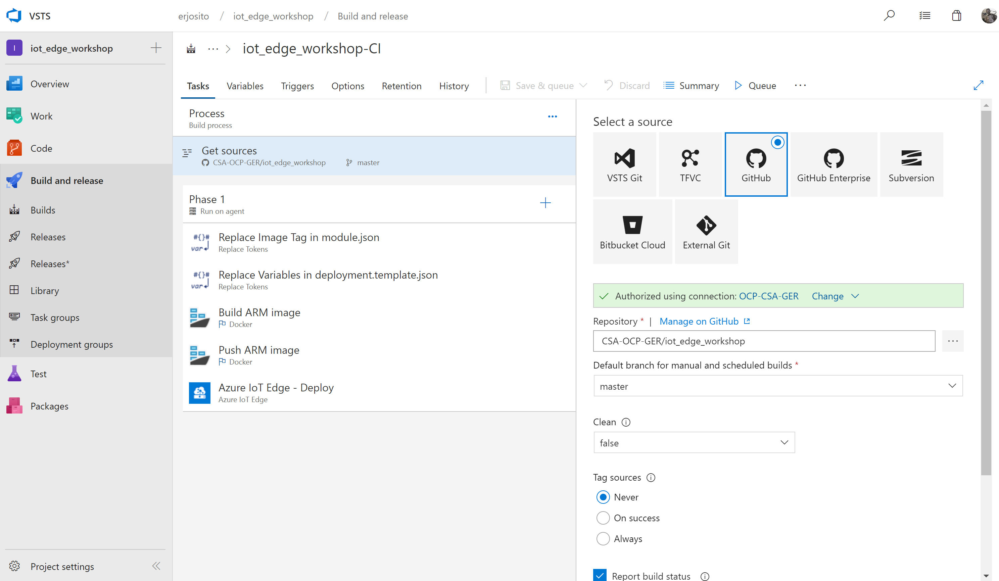

# Creating a VSTS Pipeline for Azure IoT Edge

After you have created a project and linked it to your Github repository, we can create a Build pipeline for Continuous Integration. The first thing we will do in our pipelin is defining some variables with the ACR credentials and the tag we want to assign to our Docker images.

The first step of the build pipeline will be getting the source code from Github. You should have this step automatically included in your pipeline, if you associated your project to Github.

Since you removed all confidential information from the source code, you can replace the variables in VSTS to include the actual credentials. We will do that in the `module.json` file and in the `deployment.template.json file`. We will use a variable as well to set the tag to the build number. You will probably need to install the Token Replacement extension in your VSTS environment.

We are ready to start building our Docker image. We can use the Docker tasks to build and push the image.

The containers are created, now we can deploy them. The most comfortable way is using the Azure IoT Edge extension for that (you will probably have to install it too). Note that this extension can be configured to build and push the containers, but since we already did that with the Docker tasks, we are using it only to deploy those containers to the IoT hub:

Lastly, you could configure the pipeline to run automatically after every commit to the Github repository where the code is based on. You would do that in the Triggers section of the pipeline:

